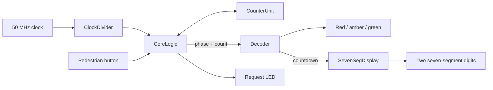

# FPGA Traffic Light Controller

**A structural Verilog controller with pedestrian requests, timed signal phases, and a two-digit countdown.**

Built as an ELEC2665 digital design coursework project for the **Terasic DE10-Lite / Intel MAX 10**, this design connects gate-level arithmetic, counters, control logic, and display decoding into a complete RTL system.

**Language:** Verilog · **Tools:** ModelSim and Intel Quartus · **Target:** DE10-Lite / MAX 10

## At a glance

- **Four phases:** red → amber → green → amber, repeating automatically.
- **Pedestrian request:** an active-low button latches a request and extends red from 10 to 15 clock ticks; an LED indicates the pending request.
- **Live countdown:** two active-low seven-segment outputs display the remaining phase count.
- **Structural datapath:** one-bit full adders form a four-bit ripple-carry adder, reused for incrementing and subtraction.
- **Small footprint:** the archived Quartus fitter report records **67 logic elements and 33 registers**, with no block memory or PLLs.

The design divides a 50 MHz input into a 1 Hz clock. Normal phase lengths are **10 / 3 / 10 / 3 ticks**, and the displayed countdown runs to **1** before advancing. The initial phase after reset begins partway through the divided-clock period.

## Design



`CoreLogic` carries the two-bit phase and a latched pedestrian request. `CounterUnit` counts upward until it matches the selected terminal value. `Decoder` selects the lamps and subtracts the elapsed count from the phase duration. `BinaryBCD` and `BCD7Seg` convert that result into decimal digits and segment patterns.

**Start reading:** [top-level wiring](rtl/MainCode.v) · [phase and request control](rtl/CoreLogic.v) · [structural counter](rtl/CounterUnit.v) · [ModelSim testbenches](tb/legacy/)

## Simulation in ModelSim

The original design was tested by the author in **ModelSim** using the 14 Verilog testbenches included in `tb/legacy/`. Each bench supplies input stimulus for its corresponding module and stops for waveform inspection.

1. Create a ModelSim project and add the design files from `rtl/` and the testbenches from `tb/legacy/`.
2. Compile the files, then select a testbench such as `CoreLogic_tb` as the simulation top level.
3. Add the testbench and device-under-test signals to the waveform window.
4. Run until the testbench reaches `$stop`, then inspect the inputs, state, and outputs.

Useful starting points are [`CoreLogic_tb.v`](tb/legacy/CoreLogic_tb.v) for phase and pedestrian-request stimulus, [`CounterUnit_tb.v`](tb/legacy/CounterUnit_tb.v) for counter behavior, and [`SevenSegDisplay_tb.v`](tb/legacy/SevenSegDisplay_tb.v) for decimal display conversion.

These are stimulus-based tests with manual waveform inspection. The original divider and top-level benches run too briefly to observe a full 1 Hz period; use the core-level bench to inspect phase changes with its faster simulated clock. No ModelSim rerun was performed during repository packaging.

## Open in Quartus

1. Open `quartus/ELEC2665S2Project.qpf` in Quartus with MAX 10 device support.
2. Confirm the configured device, `10M50DAF484C6GES`, matches your hardware and installed device support.
3. Set board pin locations and I/O standards for the clock, active-low reset/button, lamps, request LED, and displays.
4. Add appropriate input and generated-clock timing constraints, compile, and review timing before programming.

The project metadata references Quartus 22.1; the archived successful fitter run used Quartus 17.1.1. This repository has not been rebuilt in Quartus during packaging.

## Engineering notes

This repository preserves the original RTL behavior. The [implementation notes](docs/implementation-notes.md) describe button sampling, boundary behavior, and practical improvements. The archived timing report contains negative slack, and the supplied project has no explicit pin assignments or SDC file; **timing closure and board-ready reproducibility remain future work**.

## Repository layout

```text
rtl/                 14 original design modules
tb/legacy/           14 original stimulus testbenches
quartus/             Project settings with portable source paths
docs/                Implementation notes and archived build evidence
```

